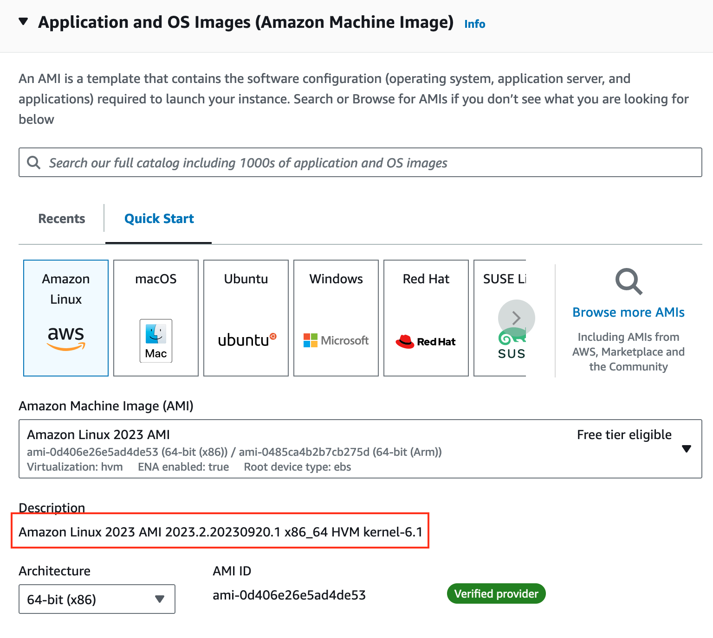
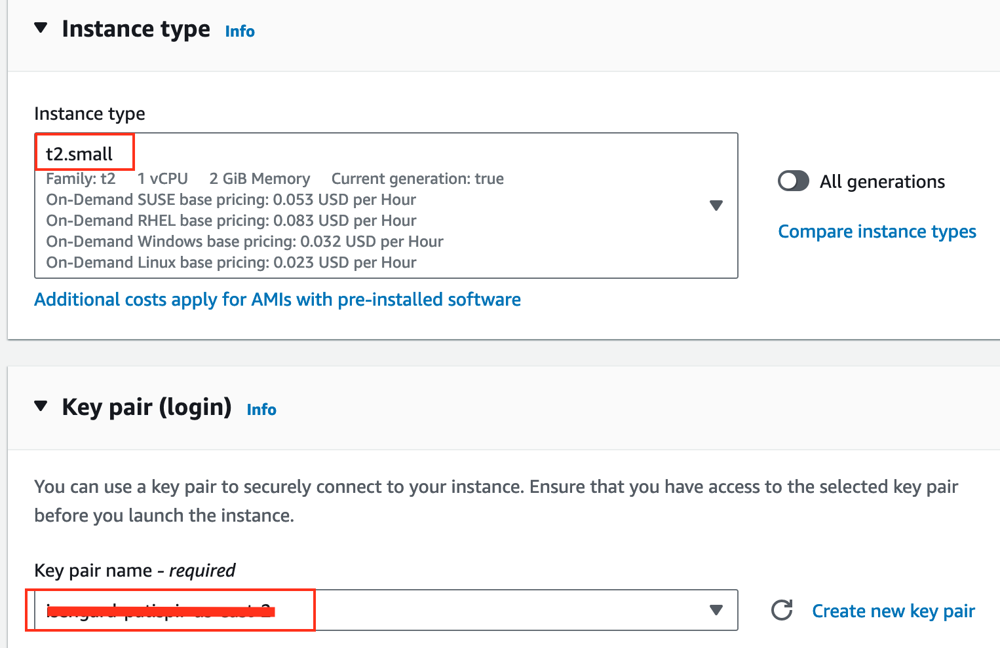
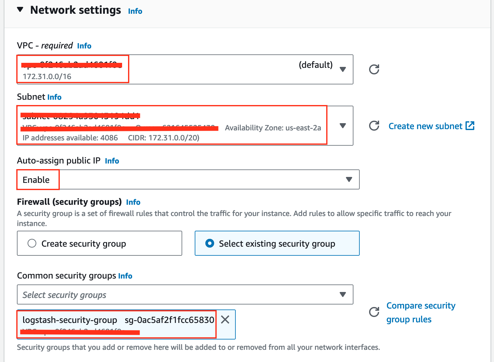
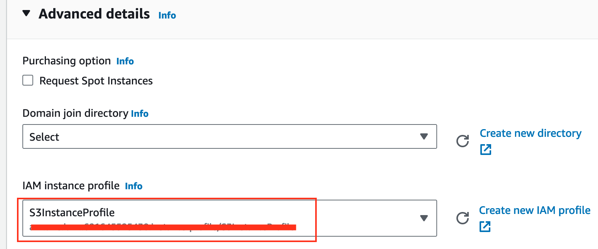
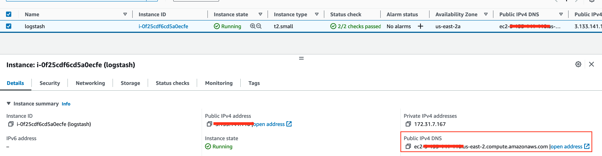
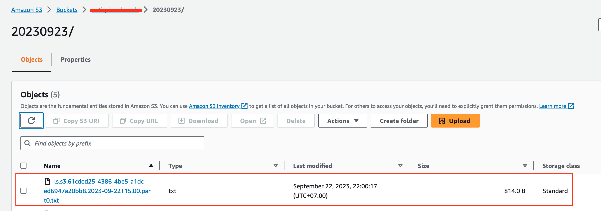
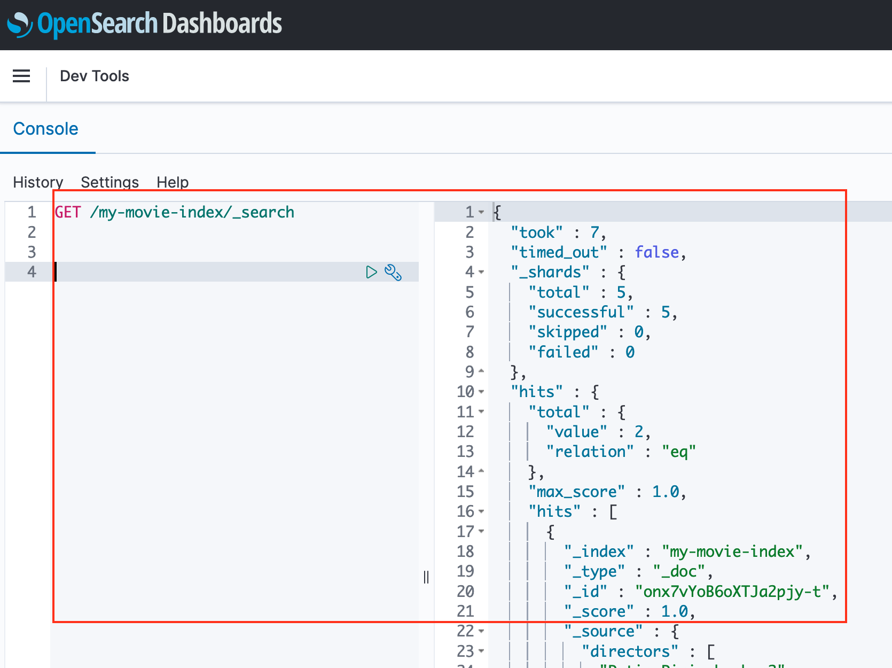

# Migrate data from Elasticsearch to Amazon S3 and Amazon OpenSearch Service with Logstash

In this project, we will demontrate how to migrate data from Elasticseach v7.10 to Amazon S3 and Amazon OpenSearch Service v1.3

## Prerequisite
1. Elasticsearch v7.10
2. S3 Bucket
3. Amazon OpenSearch Service v1.3. 

---

## Note

For testing purpose,

1. This example will use `Public` Elasticsearch and Amazon OpenSearch Service as well as EC2 Instance that will create in the instruction.

2. Elasticserch is running on `Public` with `Enable` `Fine-grained access control`. So that, authentication will use username and password. For `Access policy`, this example allows all principal.

```
{
  "Version": "2012-10-17",
  "Statement": [
    {
      "Effect": "Allow",
      "Principal": {
        "AWS": "*"
      },
      "Action": "es:*",
      "Resource": "arn:aws:es:us-east-2:<AWS_ACCOUNT>:domain/<ES_NAME>/*"
    }
  ]
}
```

3. Amazon OpenSearch Service is running on `Public` with `Disable` `Fine-grained access control`. So that, authentication will not use username and password. For `Access policy`, this example add `IPv4 address` of 1) local machine to access dashboard and 2) ec2 to send data to Amazon OpenSearch Service.

```
{
  "Version": "2012-10-17",
  "Statement": [
    {
      "Effect": "Allow",
      "Principal": {
        "AWS": "*"
      },
      "Action": "es:*",
      "Resource": "arn:aws:es:us-east-2:<AWS_ACCOUNT>:domain/<OSS_NAME>/*",
      "Condition": {
        "IpAddress": {
          "aws:SourceIp": [
            "<LOCAL_MACHINE_IP>",
            "<EC2_IP>"
          ]
        }
      }
    }
  ]
}
```

---

## Instruction

### 1. Create EC2 Intance

#### 1.1 Input name and Select AMI

After Input Name as `logstash` then select AMI `Amazon Linux 2023 AMI 2023.2.20230920.1 x86_64 HVM kernel-6.1`



#### 1.2 Select Instance type and key pair

Select instance type : `t2.small`

Optional: Select `Key pair` (Because we will access ec2 instance from local terminal in this example). Otherwise, you can access EC2 Instance Connect or Session Manager



#### 1.3 Network Setting

For testing purpose, we will use `default VPC` with `public subnet` and `enable` Auto-assign public IP.
Please make sure `security groups` allow `SSH access` on port `22` from `Local machine IP` 



#### 1.4 Advanced Setting

Please make sure IAM instance profile has policy to access to S3 Bucket



#### 1.5 Launch Instance and access instance

Launch Instance.

Get `Public IPv4 DNS` in Detials




Connect to EC2 Instance from local terminal by running command:

```bash
ssh -i <PRIVAT_KEY>.pem ec2-user@<Public IPv4 DNS>

   ,     #_
   ~\_  ####_        Amazon Linux 2023
  ~~  \_#####\
  ~~     \###|
  ~~       \#/ ___   https://aws.amazon.com/linux/amazon-linux-2023
   ~~       V~' '->
    ~~~         /
      ~~._.   _/
         _/ _/
       _/m/'
Last login: Fri Sep 22 14:37:18 2023 from 115.87.199.123
[ec2-user@ip-172-31-7-167 ~]$
```

---

### 2. Install and Config Logstash on EC2 Intance

#### 2.1 Create a yum repository for logstash

Create file logstash.repo

```bash
sudo vi /etc/yum.repos.d/logstash.repo
```

Input logstash repository to this file.

```
[logstash-7.x] 
name=Elastic repository for 7.x packages
baseurl=https://artifacts.elastic.co/packages/7.x/yum
gpgcheck=1
gpgkey=https://artifacts.elastic.co/GPG-KEY-elasticsearch
enabled=1
autorefresh=1
type=rpm-md
```

Save and Quit

#### 2.2 Install logstash

Install logstash version `7.10.0-1`

and enter `Y` to confirm

```bash
sudo yum install logstash-7.10.0-1

Elastic repository for 7.x packages                                                                                                                                                    32 MB/s |  53 MB     00:01
Last metadata expiration check: 0:00:15 ago on Fri Sep 22 14:46:46 2023.
Dependencies resolved.
======================================================================================================================================================================================================================
 Package                                           Architecture                                    Version                                                Repository                                             Size
======================================================================================================================================================================================================================
Installing:
 logstash                                          x86_64                                          1:7.10.0-1                                             logstash-7.x                                          336 M

Transaction Summary
======================================================================================================================================================================================================================
Install  1 Package
.
.
.
.
.
OpenJDK 64-Bit Server VM warning: Option UseConcMarkSweepGC was deprecated in version 9.0 and will likely be removed in a future release.
/usr/share/logstash/vendor/bundle/jruby/2.5.0/gems/pleaserun-0.0.31/lib/pleaserun/platform/base.rb:112: warning: constant ::Fixnum is deprecated
Successfully created system startup script for Logstash

  Verifying        : logstash-1:7.10.0-1.x86_64                                                                                                                                                                   1/1

Installed:
  logstash-1:7.10.0-1.x86_64

Complete!
```


#### 2.3 Create logstash configuration file

Create file logstash.conf

```bash
sudo vi /etc/logstash/conf.d/logstash.conf
```

Input logstash configuration to this file.

Replace `<ES_DOMAIN_ENDPOINT>`, index, query, `<ES_USERNAME>`, `<ES_PASSWORD>`, `<S3_BUCKET>`, `<S3_BUCKET_REGION>`, `<PREFIX>` to match with you case.

```
input {
  elasticsearch {
    hosts => ["https://<ES_DOMAIN_ENDPOINT>"]
    index => "my-movie-index"
    query => '{ "query": { "term": { "title": { "value": "test" } } } }'
    user => "<ES_USERNAME>"
    password => "<ES_PASSWORD>"
  }
}

filter {
  # Your filter configuration here
}

output {
  s3 {
    bucket => "<S3_BUCKET>"
    region => "<S3_BUCKET_REGION>"
    canned_acl => "private"
    prefix => "<PREFIX>/"
    time_file => 10
    codec => json_lines {}
  }
}
```

Save and Quit

---
### 3. Execute logstash and view result on S3

Execute logstash

```
sudo /usr/share/logstash/bin/logstash -f /etc/logstash/conf.d/logstash.conf --path.settings /etc/logstash/

Using bundled JDK: /usr/share/logstash/jdk
OpenJDK 64-Bit Server VM warning: Option UseConcMarkSweepGC was deprecated in version 9.0 and will likely be removed in a future release.
WARNING: An illegal reflective access operation has occurred
WARNING: Illegal reflective access by org.jruby.ext.openssl.SecurityHelper (file:/tmp/jruby-3374/jruby17848383303223814156jopenssl.jar) to field java.security.MessageDigest.provider
WARNING: Please consider reporting this to the maintainers of org.jruby.ext.openssl.SecurityHelper
WARNING: Use --illegal-access=warn to enable warnings of further illegal reflective access operations
WARNING: All illegal access operations will be denied in a future release
Sending Logstash logs to /var/log/logstash which is now configured via log4j2.properties
[2023-09-22T14:59:17,813][INFO ][logstash.runner          ] Starting Logstash {"logstash.version"=>"7.10.0", "jruby.version"=>"jruby 9.2.13.0 (2.5.7) 2020-08-03 9a89c94bcc OpenJDK 64-Bit Server VM 11.0.8+10 on 11.0.8+10 +indy +jit [linux-x86_64]"}
[2023-09-22T14:59:18,158][INFO ][logstash.setting.writabledirectory] Creating directory {:setting=>"path.queue", :path=>"/var/lib/logstash/queue"}
[2023-09-22T14:59:18,192][INFO ][logstash.setting.writabledirectory] Creating directory {:setting=>"path.dead_letter_queue", :path=>"/var/lib/logstash/dead_letter_queue"}
[2023-09-22T14:59:18,957][WARN ][logstash.config.source.multilocal] Ignoring the 'pipelines.yml' file because modules or command line options are specified
[2023-09-22T14:59:19,012][INFO ][logstash.agent           ] No persistent UUID file found. Generating new UUID {:uuid=>"dbd5ff03-46d8-42e2-9db0-608d6643c1e5", :path=>"/var/lib/logstash/uuid"}
[2023-09-22T14:59:21,942][INFO ][org.reflections.Reflections] Reflections took 83 ms to scan 1 urls, producing 23 keys and 47 values
[2023-09-22T15:00:11,982][INFO ][logstash.javapipeline    ][main] Starting pipeline {:pipeline_id=>"main", "pipeline.workers"=>1, "pipeline.batch.size"=>125, "pipeline.batch.delay"=>50, "pipeline.max_inflight"=>125, "pipeline.sources"=>["/etc/logstash/conf.d/logstash.conf"], :thread=>"#<Thread:0x66af899e run>"}
[2023-09-22T15:00:13,506][INFO ][logstash.javapipeline    ][main] Pipeline Java execution initialization time {"seconds"=>1.48}
[2023-09-22T15:00:14,356][INFO ][logstash.javapipeline    ][main] Pipeline started {"pipeline.id"=>"main"}
[2023-09-22T15:00:14,498][INFO ][logstash.agent           ] Pipelines running {:count=>1, :running_pipelines=>[:main], :non_running_pipelines=>[]}
[2023-09-22T15:00:15,297][INFO ][logstash.agent           ] Successfully started Logstash API endpoint {:port=>9600}
[2023-09-22T15:00:16,569][INFO ][logstash.javapipeline    ][main] Pipeline terminated {"pipeline.id"=>"main"}
[2023-09-22T15:00:16,800][INFO ][logstash.runner          ] Logstash shut down.
```

Congratulations!!! Now, let check result on Amazon S3.

You will see new file in the S3 Bucket that you have config on previous step



---

### 4. Install Logstash Plugin for Opensearch and Update Logstash Config

#### 4.1 Install Logstash Plugin for Opensearch

Install Logstash Plugin for Opensearch by following command

```bash
cd /usr/share/logstash
sudo bin/logstash-plugin install logstash-output-opensearch

Using bundled JDK: /usr/share/logstash/jdk
OpenJDK 64-Bit Server VM warning: Option UseConcMarkSweepGC was deprecated in version 9.0 and will likely be removed in a future release.
WARNING: An illegal reflective access operation has occurred
WARNING: Illegal reflective access by org.jruby.ext.openssl.SecurityHelper (file:/usr/share/logstash/vendor/jruby/lib/ruby/stdlib/jopenssl.jar) to field java.security.MessageDigest.provider
WARNING: Please consider reporting this to the maintainers of org.jruby.ext.openssl.SecurityHelper
WARNING: Use --illegal-access=warn to enable warnings of further illegal reflective access operations
WARNING: All illegal access operations will be denied in a future release
Validating logstash-output-opensearch
Installing logstash-output-opensearch
Installation successful
```

#### 4.2 Update logstash configuration file

Update file logstash.conf

```bash
sudo vi /etc/logstash/conf.d/logstash.conf
```

`input` and `filter` is the same on S3. Please update only on `output` section.

Update `<OSS_DOMAIN_ENDPOINT>`.

Note: Please make sure Opensearch Domain Endpoint has `:433` at the end of host url.

```
input {
  elasticsearch {
    hosts => ["https://<ES_DOMAIN_ENDPOINT>"]
    index => "my-movie-index"
    query => '{ "query": { "term": { "title": { "value": "test" } } } }'
    user => "<ES_USERNAME>"
    password => "<ES_PASSWORD>"
  }
}

filter {
  # Your filter configuration here
}

output {
    opensearch {
        ecs_compatibility => disabled
        index => "my-movie-index"
        hosts => "https://<OSS_DOMAIN_ENDPOINT>:443"
    }
}
```

Save and Quit

---

### 5. Execute logstash and view result on Amazon Opensearch

Execute logstash

```
sudo /usr/share/logstash/bin/logstash -f /etc/logstash/conf.d/logstash.conf --path.settings /etc/logstash/

Using bundled JDK: /usr/share/logstash/jdk
OpenJDK 64-Bit Server VM warning: Option UseConcMarkSweepGC was deprecated in version 9.0 and will likely be removed in a future release.
WARNING: An illegal reflective access operation has occurred
WARNING: Illegal reflective access by org.jruby.ext.openssl.SecurityHelper (file:/tmp/jruby-4345/jruby10142174395175209969jopenssl.jar) to field java.security.MessageDigest.provider
WARNING: Please consider reporting this to the maintainers of org.jruby.ext.openssl.SecurityHelper
WARNING: Use --illegal-access=warn to enable warnings of further illegal reflective access operations
WARNING: All illegal access operations will be denied in a future release
Sending Logstash logs to /var/log/logstash which is now configured via log4j2.properties
[2023-09-22T15:21:35,343][INFO ][logstash.runner          ] Starting Logstash {"logstash.version"=>"7.10.0", "jruby.version"=>"jruby 9.2.13.0 (2.5.7) 2020-08-03 9a89c94bcc OpenJDK 64-Bit Server VM 11.0.8+10 on 11.0.8+10 +indy +jit [linux-x86_64]"}
[2023-09-22T15:21:36,486][WARN ][logstash.config.source.multilocal] Ignoring the 'pipelines.yml' file because modules or command line options are specified
[2023-09-22T15:21:39,403][INFO ][org.reflections.Reflections] Reflections took 84 ms to scan 1 urls, producing 23 keys and 47 values
[2023-09-22T15:21:40,388][INFO ][logstash.outputs.opensearch][main] New OpenSearch output {:class=>"LogStash::Outputs::OpenSearch", :hosts=>["https://search-public-os-13-uhsdsfm6jifwj5yrrgzr5fh5oy.us-east-2.es.amazonaws.com:443"]}
[2023-09-22T15:21:41,191][INFO ][logstash.outputs.opensearch][main] OpenSearch pool URLs updated {:changes=>{:removed=>[], :added=>[https://search-public-os-13-uhsdsfm6jifwj5yrrgzr5fh5oy.us-east-2.es.amazonaws.com:443/]}}
[2023-09-22T15:21:42,029][WARN ][logstash.outputs.opensearch][main] Restored connection to OpenSearch instance {:url=>"https://search-public-os-13-uhsdsfm6jifwj5yrrgzr5fh5oy.us-east-2.es.amazonaws.com:443/"}
[2023-09-22T15:21:42,162][INFO ][logstash.outputs.opensearch][main] Cluster version determined (1.3.2) {:version=>1}
[2023-09-22T15:21:42,484][INFO ][logstash.outputs.opensearch][main] Using a default mapping template {:version=>1, :ecs_compatibility=>:disabled}
[2023-09-22T15:21:42,527][INFO ][logstash.javapipeline    ][main] Starting pipeline {:pipeline_id=>"main", "pipeline.workers"=>1, "pipeline.batch.size"=>125, "pipeline.batch.delay"=>50, "pipeline.max_inflight"=>125, "pipeline.sources"=>["/etc/logstash/conf.d/logstash.conf"], :thread=>"#<Thread:0xd42ef72 run>"}
[2023-09-22T15:21:44,035][INFO ][logstash.javapipeline    ][main] Pipeline Java execution initialization time {"seconds"=>1.5}
[2023-09-22T15:21:44,466][INFO ][logstash.javapipeline    ][main] Pipeline started {"pipeline.id"=>"main"}
[2023-09-22T15:21:44,591][INFO ][logstash.agent           ] Pipelines running {:count=>1, :running_pipelines=>[:main], :non_running_pipelines=>[]}
[2023-09-22T15:21:45,343][INFO ][logstash.agent           ] Successfully started Logstash API endpoint {:port=>9600}
[2023-09-22T15:21:47,265][INFO ][logstash.javapipeline    ][main] Pipeline terminated {"pipeline.id"=>"main"}
[2023-09-22T15:21:47,420][INFO ][logstash.runner          ] Logstash shut down.
```

Congratulations!!! Now, let check result on Amazon Opensearch Service.

By using `Dev Tools`, You can check the result by query from `index` that you have config on previous step



---

## References

- [Migrate your indexes to Amazon OpenSearch Serverless with Logstash](https://aws.amazon.com/blogs/big-data/migrate-your-indexes-to-amazon-opensearch-serverless-with-logstash/)

- [Install and config logstash](https://www.educba.com/logstash-aws/)

- [Install logstash on specific version](https://discuss.elastic.co/t/update-logstash-to-specific-version/274503)

- [ES to S3 Logstash Pipeline](https://stackoverflow.com/questions/75449276/export-50-gb-elasticsearch-indices-to-s3-as-json-text)

- [Run logstah  in Amazon EC2 (Amazon Linux 2 AMI)](https://discuss.elastic.co/t/run-logstah-pipeline-continously-in-amazon-ec2-amazon-linux-2-ami/207823)

- [Dive into Amazon OpenSearch Service to populate sample data](https://catalog.us-east-1.prod.workshops.aws/workshops/f0213896-4dd9-494a-89c5-f7886b45ed4a/en-US)

- [Loading data into Amazon OpenSearch Service with Logstash](https://docs.aws.amazon.com/opensearch-service/latest/developerguide/managedomains-logstash.html)

- [How to Install Elastic Stack 8.x on Amazon Linux 2 | Configure Elasticsearch Logstash and Kibana](https://www.youtube.com/watch?v=Pce2O3AYT8g)

- [Install logstash plugin](https://stackoverflow.com/questions/37830612/amazon-es-output-plugin-installation-error-on-an-ec2-instance)

- [Elastic: Working with plugins](https://www.elastic.co/guide/en/logstash/current/working-with-plugins.html)

- [Install logstash opensearch plugin](https://forum.opensearch.org/t/logstash-v8-1-1-compatibility-with-opensearch/9095/9)

- [Logstash Output OpenSearch](https://github.com/opensearch-project/logstash-output-opensearch)

- [Troubleshooting: Logstash warning Opensearch unreachable](https://stackoverflow.com/questions/75598950/logstash-warning-opensearch-unreachable)

---